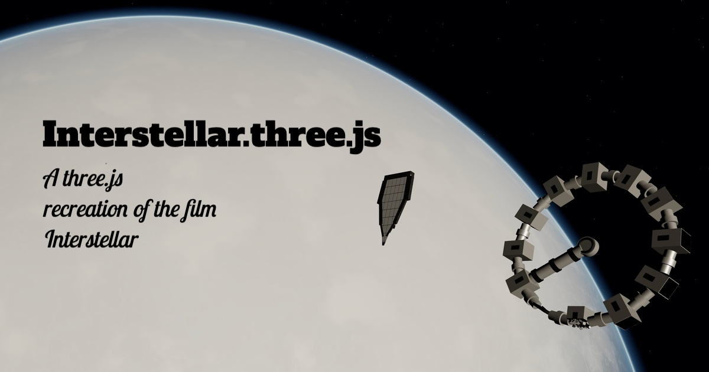

# Interstellar.three.js

Interactive Three.js + WebGPU recreation of 13 iconic scenes from *Interstellar*, built as a single cinematic sequence with free-look camera controls and scene-to-scene transitions.

Visit live on https://interstellar3.scottsun.io



## Highlights

- 13 scene modules loaded in chronological order
- WebGPU renderer (`three/webgpu`) with TSL/node-material effects
- Cinematic fade transitions between scenes
- In-app scene navigator (jump directly to any scene)
- Pointer-lock camera controls (`WASD`, mouse-look, vertical movement)
- Background score playback after entering the experience

## Stack

- React 19
- Vite 7
- Three.js 0.183 (`three/webgpu`, `three/tsl`)
- ESLint 9

## Requirements

- Node.js 18+ (Node.js 20+ recommended)
- npm
- A WebGPU-capable browser/device

If WebGPU is unavailable, the app shows a startup error and does not fall back to WebGL.

## Quick Start

```bash
npm install
npm run dev
```

Open the local URL printed by Vite (typically `http://localhost:5173`).

## Available Scripts

- `npm run dev` - start local dev server
- `npm run build` - create production build in `dist/`
- `npm run preview` - preview production build locally
- `npm run lint` - run ESLint

## Controls

- Click inside the viewport to lock pointer and enable look controls
- Mouse: look around
- `W` / `A` / `S` / `D`: move forward / left / backward / right
- `Space`: move up
- `Shift`: move down
- `Esc`: release pointer lock
- `Scenes` button: open the scene navigator menu
- `Previous Scene` / `Next Scene` buttons: move through the timeline

## Scene Timeline

1. Cooper Farmhouse and Cornfield Intro
2. Cornfield Drone Chase
3. Dust Storm and Murph's Anomaly
4. Secret NASA Facility Reveal
5. Endurance Launch from Earth
6. Endurance Near Saturn
7. Wormhole Crossing Sequence
8. Miller's Planet and Wave
9. Dr. Mann's Ice Planet
10. Endurance Spin-Docking Maneuver
11. Slingshot Around Gargantua
12. Tesseract Bookshelf Sequence
13. Cooper Station Reunion

## Project Structure

```text
src/
  App.jsx                       # UI shell, overlays, scene HUD/menu, transitions
  three/
    ThreeApp.js                 # renderer bootstrap, camera, controls, render loop
    SceneManager.js             # scene lifecycle + sequencing
    controls/PointerLookControls.js
    scenes/
      sceneManifest.js          # ordered scene registry
      01CooperFarmhouseScene.js
      ...
      13CooperStationScene.js
    utils/dispose.js            # shared disposal helpers
public/
  music.mp3
  textures/
dev_docs/
  plan.md
  build_scenes.md
```

## Scene Module Contract

Each scene is a module with metadata + lifecycle methods:

```js
export default {
  id: 'scene-id',
  title: 'Scene Title',
  create() {
    return {
      init({ root, camera, renderer, scene }) {},
      update({ delta, elapsed, root, camera, renderer, scene }) {},
      resize({ width, height, root, camera, renderer, scene }) {},
      dispose({ root, camera, renderer, scene }) {},
    }
  },
}
```

Implementation notes:

- Add scene objects under the provided `root` group.
- Put per-frame animation in `update`.
- Fully release geometries/materials/textures/listeners in `dispose`.
- Keep scene-local React UI out of scene files.

## Building New/Updated Scenes

Use `dev_docs/build_scenes.md` as the build contract. In normal scene work, edits are intended to stay inside `src/three/scenes/*.js` so the shared app shell and scene system remain stable.

After scene changes:

```bash
npm run lint
npm run build
```

## Troubleshooting

`WebGPU Unsupported` on boot:
- Use a WebGPU-capable browser/device.
- Update browser and GPU drivers.

`Boot Sequence` never completes:
- Check browser console for renderer init errors.
- Verify the runtime environment supports WebGPU.

No movement after scene starts:
- Click the viewport first to enter pointer lock.

## Disclaimer

This is a fan recreation project inspired by *Interstellar* for educational use and for fun.
